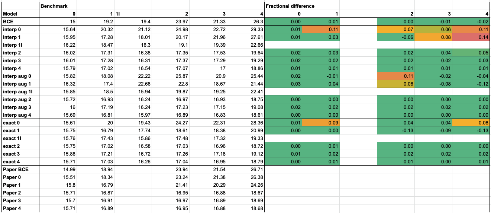

# Title


[](https://pypi.python.org/pypi/pytorch_inferno)
[](https://pypi.python.org/pypi/pytorch_inferno) [](https://pypi.python.org/pypi/pytorch_inferno)
[](https://github.com/GilesStrong/pytorch_inferno/actions)
[](https://doi.org/10.5281/zenodo.4597140)

# PyTorch INFERNO

Documentation: https://gilesstrong.github.io/pytorch_inferno/

This package provides a PyTorch implementation of INFERNO ([de Castro and Dorigo, 2018](https://www.sciencedirect.com/science/article/pii/S0010465519301948)), along with a minimal high-level wrapper for training and applying PyTorch models, and running statistical inference of parameters of interest in the presence of nuisance parameters. INFERNO is implemented in the form of a callback, allowing it to be dropped in and swapped out with heavy rewriting of code.

For a presentation of the package, check out my talk at PyHEP 2021: https://www.youtube.com/watch?v=copNcyHnHBs (slides here: https://github.com/GilesStrong/talk_pyhep21_pytorch_inferno)

For a deeper overview of the package, a breakdown of the INFERNO algorithm, and an introduction to parameter inference in HEP, I have written a 5-post blog series: https://gilesstrong.github.io/website/statistics/hep/inferno/2020/12/04/inferno-1.html

The authors' Tensorflow 1 code may be found here: https://github.com/pablodecm/paper-inferno
And Lukas Layer's Tenforflow 2 version may be found here: https://github.com/llayer/inferno

For a talk and tutorial on PyTorch INFERNO, please see https://github.com/GilesStrong/talk_pyhep21_pytorch_inferno, and https://youtu.be/5aWAxvdrszw?t=13543 for the YouTube recording.

### User install
```
pip install pytorch_inferno
```

### Developer install
```
[install torch>=1.7 according to CUDA version]
pip install nbdev fastcore numpy pandas fastprogress matplotlib>=3.0.0 seaborn scipy
git clone git@github.com:GilesStrong/pytorch_inferno.git
cd pytorch_inferno
pip install -e .
nbdev_install_git_hooks
```

## Overview
Library developed and testing in `nbs` directory.

Experiments run in `experiments` directory.

Use `nbdev_build_lib` to export code to library located in `pytorch_inferno`. This overwrites any changes in `pytorch_inferno`, i.e. only edit the notebooks.

## Results

This package has been tested against the paper problem and reproduces its results within uncertainty


## Reference

If you have used this implementation of INFERNO in your analysis work and wish to cite it, the preferred reference is: *Giles C. Strong, pytorch_inferno, Zenodo (Mar. 2021), http://doi.org/10.5281/zenodo.4597140, Note: Please check https://github.com/GilesStrong/pytorch_inferno/graphs/contributors for the full list of contributors*

```
@misc{giles_chatham_strong_2021_5040810,  
  author       = {Giles Chatham Strong},  
  title        = {pytorch\_inferno},  
  month        = jun,  
  year         = 2021,  
  note         = {{Please check https://github.com/GilesStrong/pytorch_inferno/graphs/contributors for the full list of contributors}},  
  doi          = {10.5281/zenodo.4597140},  
  url          = {https://doi.org/10.5281/zenodo.4597140}  
}
```

The INFERNO algorithm should also be cited:
```
@article{DECASTRO2019170,
    title = {INFERNO: Inference-Aware Neural Optimisation},
    journal = {Computer Physics Communications},
    volume = {244},
    pages = {170-179},
    year = {2019},
    issn = {0010-4655},
    doi = {https://doi.org/10.1016/j.cpc.2019.06.007},
    url = {https://www.sciencedirect.com/science/article/pii/S0010465519301948},
    author = {Pablo {de Castro} and Tommaso Dorigo},
}
```
